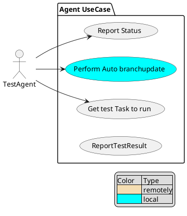

**Table of contents**

* [Supported test agent use cases](#supported-test-agent-use-cases)
* [Supported test server use cases](#supported-test-server-use-cases)
* [Choose the right framework for communication](#choose-the-right-framework-for-communication)
* [Open issues](open-issues)

### Supported test agent use cases:
[diagram source](docs\diagrams\TestAgentUsecase.puml)

### Choose the right framework for communication

* server has to know agents connected/disconnected for agent status dashboard

* Is bi-directional communication needed ?

* gRPC supports js client ?

### Open issues

